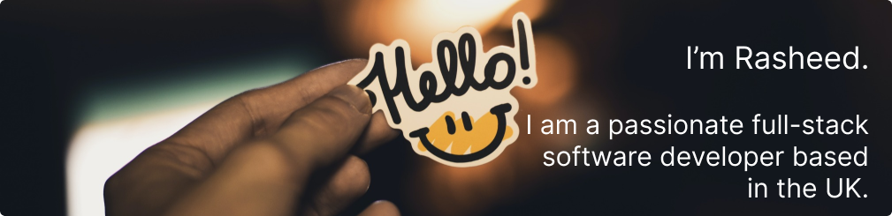
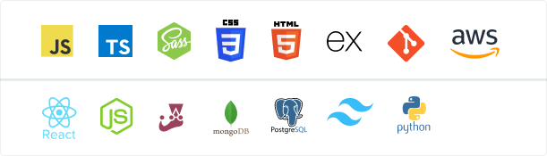

- 🔭 I’m currently working on [The Erudite Speakers Website](https://github.com/desokan/speakaz_frontend)

- 🌱 I’m currently learning **AWS and Python**

- 📫 How to reach me **adesokanrasheed@yahoo.co.uk**

- 📄 Know about my experiences [https://app.enhancv.com/share/7b091011/?utm_medium=growth&utm_campaign=share-resume&utm_source=dynamic](https://app.enhancv.com/share/7b091011/?utm_medium=growth&utm_campaign=share-resume&utm_source=dynamic)

<h3 align="left">Connect with me: </h3>

<h3 align="left">Languages and Tools:</h3>

&nbsp;

